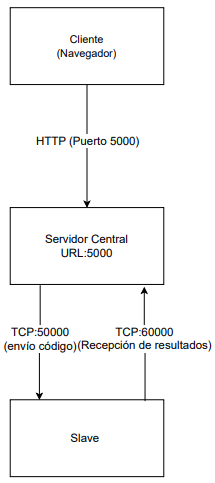
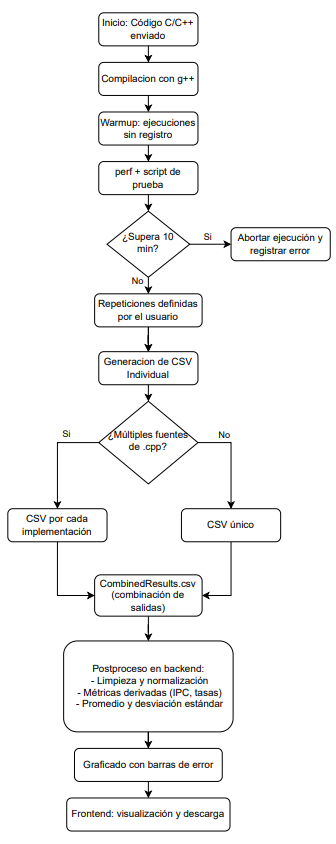
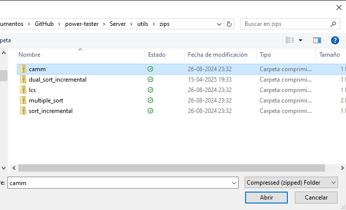
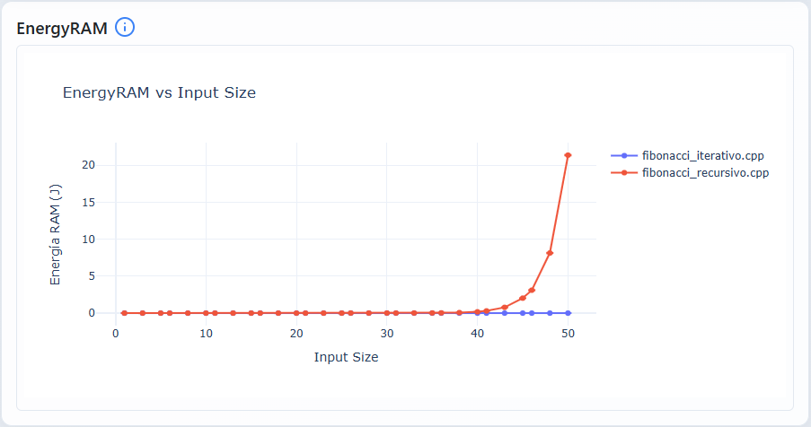
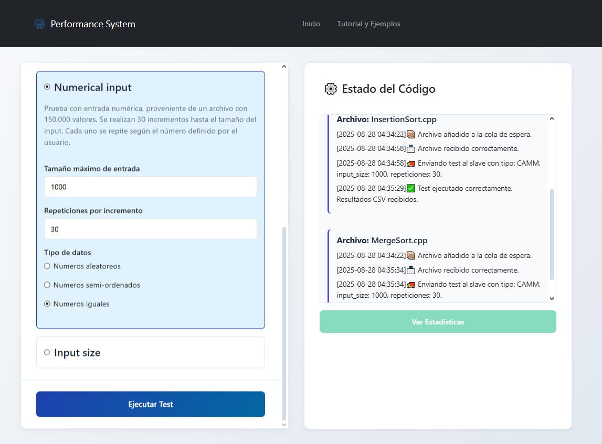
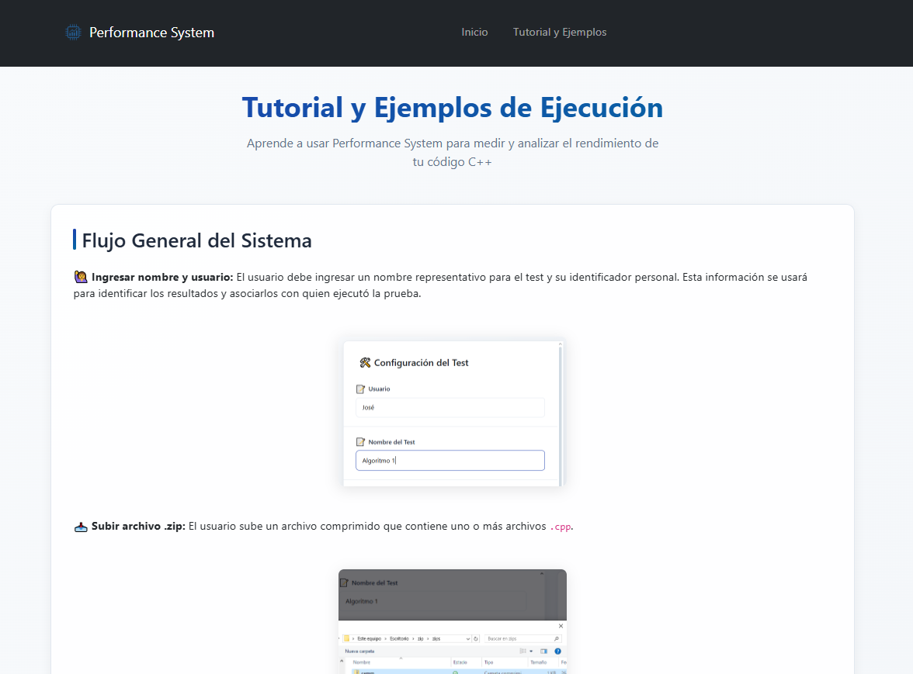
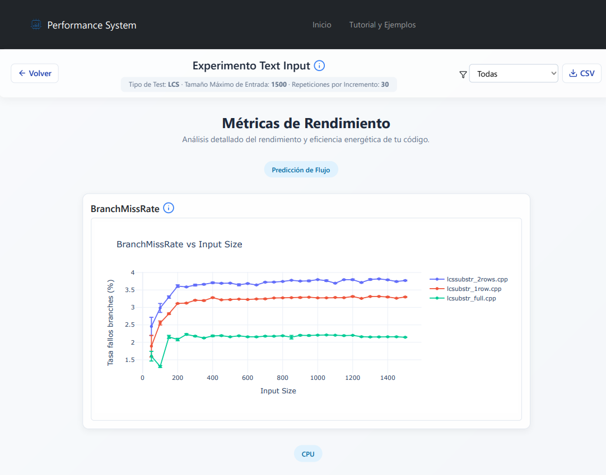

# Performance System – Plataforma de medición de rendimiento y consumo energético

**Performance System** es una plataforma web que permite medir el rendimiento y consumo energético de programas en C y C++, orientada al apoyo docente en la asignatura **Estructuras de Datos**.  
El sistema ejecuta implementaciones algorítmicas en un entorno controlado y presenta métricas categorizadas en **CPU, Memoria, Sistema, Tiempo y Energía**, utilizando la herramienta `perf` de Linux junto con Intel RAPL.

---

## 🔎 Arquitectura

La plataforma está basada en una arquitectura **cliente–servidor** con tres componentes principales:

- **Frontend (React)**: interfaz web donde los estudiantes suben sus códigos y visualizan métricas y gráficos.
- **Backend (Flask + Gunicorn)**: servidor que coordina la recepción de código, ejecución de pruebas en los medidores y consolidación de resultados.
- **Slaves (Python)**: equipos medidores que compilan, ejecutan y registran métricas de los programas.

### Diagrama de puertos

- **5000** → Backend (Flask+Gunicorn, expone el frontend y las APIs).  
- **50000** → Canal de envio desde el Servidor.  
- **60000** → Canal de recepción de resultados desde Slaves.

---

## 🔄 Flujo de ejecución

1. El estudiante sube un `.zip` con uno o más archivos `.cpp`.  
2. El backend lo distribuye a los medidores.  
3. Cada Slave compila el código, ejecuta *warmup* y corre mediciones con `perf`.  
4. Se generan CSVs individuales por cada fuente y un `CombinedResults.csv`.  
5. El backend procesa resultados (normalización, promedios, desviaciones estándar).  
6. El frontend grafica métricas con barras de error y permite descarga de resultados.  

### Diagrama de flujo


---

## ⚙️ Instalación

### Requisitos generales
- Linux `x86_64`
- Python 3.6.15 (con `pyenv`)
- Node.js >= 12.20.0 y `npm`
- `g++` y `perf` instalados
- Conexión estable entre servidor y slaves


### Paquetes base (Ubuntu/Debian)

```bash
sudo apt update
sudo apt install -y build-essential g++ python3-pip   linux-tools-common linux-tools-generic   nodejs npm
```

---

## ⚙️ Preparación del entorno

### 1) Backend (Python)

```bash
# Instalar y activar entorno Python
pyenv install 3.6.15
pyenv virtualenv 3.6.15 mi_venv
pyenv activate mi_venv

# Dependencias
cd Server/webapp
pip install -r requirements.txt
```

### 2) Frontend (React) → build servido por Flask

```bash
cd Client/myapp   # o Cliente/my-app, según tu repo
npm install
npm run build

# Limpiar y copiar build al backend
rm -rf ../../Server/webapp/frontend/*
cp -r build/* ../../Server/webapp/frontend/
```

> Tras esto, el contenido de React se sirve desde `Server/webapp/frontend/`.

### 3) Slaves (medidores)

```bash
sudo apt install -y g++
# Verificar perf para tu kernel
uname -r
ls /usr/lib/linux-tools-$(uname -r)/perf
```

---

## 🚀 Ejecución

### 1) Inicializar inputs de ejemplo

```bash
cd Server/input
python3 init_input.py
```

### 2) Ajustar permisos de perf

```bash
echo -1 | sudo tee /proc/sys/kernel/perf_event_paranoid
```

Para hacerlo permanente:
```bash
echo "kernel.perf_event_paranoid=-1" | sudo tee -a /etc/sysctl.conf
sudo sysctl -p
```

### 3) Ajustar scripts de medición

Verifica que `measurescript*.sh` apunten a la versión de perf correspondiente:

```bash
/usr/lib/linux-tools-$(uname -r)/perf stat -e <eventos> -- <comando>
```

### 4) Levantar el backend (sirviendo frontend estático)

```bash
cd Server/webapp
gunicorn --bind 0.0.0.0:5000 wsgi:app
```

Recomendado usar `screen`:
```bash
screen -S backend
gunicorn --bind 0.0.0.0:5000 wsgi:app
# Detach: Ctrl + A + D
screen -r backend
```

### 5) Levantar un Slave

```bash
cd Server
python3 slave.py
```

---


#### Autenticación SSH sin contraseña (Para  la conexion de servidor y medidor)
```bash
ssh-keygen -t rsa -b 4096
ssh-copy-id usuario@host_remoto
```

---

#### Ejecución en segundo plano
```bash
screen -S servidor
# iniciar procesos
Ctrl + A + D   # salir
screen -r servidor   # volver
```


## 🔄 Flujo de ejecución

1. Subida de `.zip` con uno o más `.cpp`.  
2. Compilación con `g++`, *warmup* y mediciones con `perf`.  
3. Generación de CSVs individuales y `CombinedResults.csv`.  
4. Backend procesa resultados (promedio, desviación, métricas derivadas).  
5. Frontend grafica resultados y permite descarga.

Ejemplo de subida de archivo:


Resultado en gráficos:


---

## 📊 Métricas recolectadas

Las métricas se organizan en **categorías** para facilitar la interpretación:


    CPU: ["Instructions", "CpuCycles", "TaskClock", "CpuClock", "Branches", "BranchMisses" "BranchMissesPerMI", "IPC"]
    Memoria: ["LLCLoads", "LLCLoadMisses", "LLCStores", "LLCStoreMisses", "L1DcacheLoads" "L1DcacheLoadMisses", "L1DcacheStores", "CacheReferences", "CacheMisses", "CacheMissRate" "CacheMissesPerMI"]
    Sistema: ["PageFaults", "MajorFaults"]
    Tiempo: ["StartTime", "EndTime", "DurationTime"]
    Energía: ["EnergyPkg", "EnergyCores", "EnergyRAM"]
    "Predicción de Flujo": ["BranchMissRate"]

---

## 📑 Logs y manejo de errores

- En caso de **ejecución exitosa**, el Slave retorna un CSV con las métricas.  
- En caso de **error**, se envía un JSON con código de error:  
  - `100`: error de compilación  
  - `200`: timeout superado  
  - `300`: error en ejecución  
  - `400`: error de comunicación  

Esto permite que el backend muestre mensajes de estado claros en el frontend.

---

## 🖥️ Capturas de interfaz

Interfaz web con formulario, tutorial integrado y de los resultados.

  
  


---

## 🛠️ Troubleshooting

- `perf: command not found` → instala `linux-tools-$(uname -r)`.  
- `Permission error perf` → revisa `perf_event_paranoid=-1`.  
- Node incompatible → usar Node >= 12.20.0, reinstalar dependencias.  
- Puertos ocupados → revisar `ss -ltnp | grep 5000`.  
- CSV con comas decimales → verificar configuración regional.  

---

## 🧪 Pruebas disponibles

- Longest Common Substring (LCS)  
- Ordenamientos: Insertion, Merge, Heap, Bucket  
- Búsqueda binaria  
- Multiplicación de matrices  
- Entre otras 

---


## 👥 Créditos

Este proyecto es la evolución de los trabajos de:  
- **Diego Caripán Uribe (2019)** – Primera versión de PowerTester.  
- **Nicolás Parra García (2021)** – Ampliación y mejoras iniciales.  
- **José Marcelo Núñez Hidalgo (2025)** – Consolidación como *Performance System*, orientado a docencia en Estructuras de Datos.  

Profesor guía: **José Fuentes Sepúlveda** (Universidad de Concepción).  

---

## 📄 Licencia

Este software fue desarrollado en el marco de la **Memoria de Título de Ingeniería Civil Informática – Universidad de Concepción**.  
Su uso está permitido con fines académicos y de investigación.
