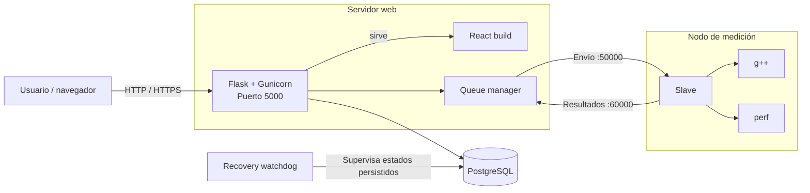
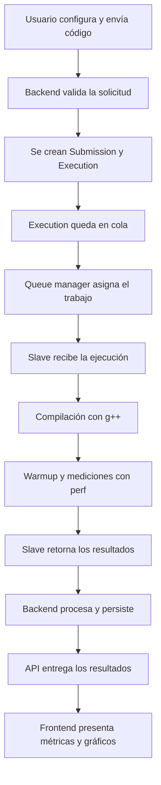

# Performance System

Plataforma web para la ejecución y análisis experimental de programas en C/C++, orientada al apoyo docente y al estudio de rendimiento computacional.

Performance System permite recibir implementaciones, ejecutar experimentos sobre un nodo de medición y presentar métricas agrupadas en categorías como **CPU, memoria, sistema, tiempo y energía**. La plataforma incorpora autenticación, persistencia de ejecuciones, perfiles experimentales, trazabilidad, administración de usuarios y funciones de supervisión académica mediante cursos.

El proyecto corresponde a una evolución sucesiva de trabajos de memoria desarrollados en la Universidad de Concepción.

---

## Características principales

- Frontend web desarrollado en React.
- Backend HTTP/API implementado en Flask y servido mediante Gunicorn.
- Autenticación institucional mediante Google OAuth.
- Roles de usuario `Student`, `Teacher` y `Admin`.
- Gestión de cursos y membresías de estudiantes.
- Persistencia PostgreSQL de usuarios, sesiones, submissions, ejecuciones y contexto experimental.
- Ejecución de programas C/C++ mediante un nodo medidor (`slave`).
- Compilación con `g++`.
- Recolección de métricas mediante Linux `perf`.
- Perfiles de ejecución configurables.
- Persistencia y trazabilidad del estado de las ejecuciones.
- Recuperación de ejecuciones obsoletas mediante un watchdog independiente.
- Procesamiento estadístico y presentación de resultados experimentales.
- Descarga de resultados para análisis posterior.

> Performance System mide comportamiento y rendimiento experimental. No valida automáticamente la corrección funcional del algoritmo enviado.

---

## Arquitectura

En una instalación local o en un despliegue donde servidor y nodo de medición comparten máquina, la arquitectura general es:


```mermaid
flowchart LR
    U["Usuario / navegador"]

    subgraph WEB["Servidor web"]
        G["Flask + Gunicorn<br/>Puerto 5000"]
        R["React build"]
        Q["Queue manager"]
    end

    DB[("PostgreSQL")]

    subgraph NODE["Nodo de medición"]
        S["Slave"]
        C["g++"]
        P["perf"]
    end

    W["Recovery watchdog"]

    U -->|HTTP / HTTPS| G
    G -->|sirve| R
    G --> DB
    G --> Q

    Q -->|Envío :50000| S
    S -->|Resultados :60000| Q

    S --> C
    S --> P

    W -->|Supervisa estados persistidos| DB
```

El frontend compilado se sirve directamente desde Flask en producción. Por ello, `npm start` se utiliza únicamente durante desarrollo y no es necesario como proceso permanente en el servidor.

El `queue_manager` forma parte del proceso web y se inicia junto con la aplicación Flask. El `recovery_watchdog` es un proceso auxiliar destinado a detectar y recuperar ejecuciones persistidas que hayan quedado en un estado obsoleto después de una interrupción inesperada.

---

## Flujo de una ejecución


```mermaid
flowchart TD
    A["Usuario configura y envía código"]
    B["Backend valida la solicitud"]
    C["Se crean Submission y Execution"]
    D["Execution queda en cola"]
    E["Queue manager asigna el trabajo"]
    F["Slave recibe la ejecución"]
    G["Compilación con g++"]
    H["Warmup y mediciones con perf"]
    I["Slave retorna los resultados"]
    J["Backend procesa y persiste"]
    K["API entrega los resultados"]
    L["Frontend presenta métricas y gráficos"]

    A --> B
    B --> C
    C --> D
    D --> E
    E --> F
    F --> G
    G --> H
    H --> I
    I --> J
    J --> K
    K --> L
```

---

## Entorno técnico validado

La versión actual ha sido validada en el siguiente entorno:

| Componente | Versión validada |
|---|---|
| Ubuntu | 20.04 LTS |
| Python | 3.8.10 |
| PostgreSQL | 12.22 |
| `g++` | 9.4.0 |
| Linux `perf` | kernel 5.15 |
| Node.js | 24.11.0 |
| npm | 11.6.1 |
| Flask | 2.0.3 |
| Gunicorn | 21.2.0 |
| React | 17.0.2 |

Las dependencias Python utilizadas durante la validación están fijadas en `requirements.txt`. Las dependencias del frontend se reproducen mediante `Client/my-app/package-lock.json`.

### Dependencias del sistema

Se requiere, como mínimo:

- Python 3 y soporte para entornos virtuales;
- PostgreSQL;
- `g++`;
- Linux `perf`;
- Node.js y npm para construir o desarrollar el frontend;
- `rsync` para el script de build de producción.

La disponibilidad de eventos de `perf`, y especialmente de métricas energéticas, depende del hardware y del soporte ofrecido por el kernel.

---

## Configuración

El repositorio incluye `.env.example`. Crear la configuración local a partir de ese archivo:

```bash
cp .env.example .env
```

y completar los valores correspondientes al entorno.

**Nunca se deben almacenar credenciales reales en Git.**

Las principales áreas configurables son:

- conexión PostgreSQL;
- clave de sesión Flask;
- Google OAuth;
- dominios institucionales admitidos;
- origen frontend y CORS;
- coordinador y puertos master/slave;
- tiempos de compilación y ejecución;
- recuperación de ejecuciones;
- ruta de `perf`;
- integración opcional para explicaciones asistidas por IA.

### Desarrollo y producción

Para desarrollo mediante HTTP:

```env
SESSION_COOKIE_SECURE=0
```

En producción, cuando la aplicación se encuentre detrás de HTTPS:

```env
SESSION_COOKIE_SECURE=1
```

Los valores de `GOOGLE_REDIRECT_URI`, `FRONTEND_LOGIN_URL`, CORS y las credenciales OAuth deben corresponder al dominio definitivo del despliegue.

---

## PostgreSQL

### Instalación nueva

Una instalación nueva utiliza directamente:

```text
Server/db/schema.sql
```

Este archivo representa el estado actual completo de la base de datos. **No debe ejecutarse repetidamente durante el arranque de la aplicación.**

El esquema incluye las tablas correspondientes a usuarios y roles, identidades OAuth y sesiones, solicitudes de acceso, cursos y membresías, submissions, executions, métricas, perfiles de hardware, auditoría y versionado del esquema.

Una instalación limpia crea 13 tablas.

### Creación inicial

El administrador PostgreSQL debe crear el rol/base de aplicación y habilitar `pgcrypto`.

Ejemplo:

```bash
sudo -u postgres psql
```

Dentro de PostgreSQL:

```sql
CREATE ROLE perf_user LOGIN PASSWORD 'REEMPLAZAR_CON_PASSWORD_SEGURO';

CREATE DATABASE performance_system
    OWNER perf_user;

\c performance_system

CREATE EXTENSION IF NOT EXISTS pgcrypto;

\q
```

No se deben almacenar contraseñas reales dentro del repositorio.

Luego, desde la raíz del proyecto, cargar el esquema utilizando el usuario de aplicación:

```bash
psql \
  -h localhost \
  -U perf_user \
  -d performance_system \
  -v ON_ERROR_STOP=1 \
  -f Server/db/schema.sql
```

`psql` solicitará la contraseña correspondiente.

Este procedimiento fue comprobado utilizando una base limpia cuyo propietario era un usuario de aplicación sin privilegios de superusuario, una vez que `pgcrypto` había sido habilitado por el administrador PostgreSQL.

### Datos iniciales

`schema.sql` crea únicamente los datos estructurales necesarios para operar el sistema:

- roles `Student`, `Admin` y `Teacher`;
- registros de `schema_migrations` correspondientes al baseline actual.

No crea usuarios, cursos, submissions, ejecuciones ni resultados ficticios.

### Actualización de bases existentes

Las instalaciones antiguas no deben recrearse con `schema.sql`.

Las migraciones disponibles se encuentran en `Server/db/migrations/`:

```text
001_core04_execution_persistence.sql
002_core07_teacher_courses.sql
003_core07_submission_course_context.sql
```

Antes de aplicar migraciones sobre una base existente debe realizarse un respaldo y ejecutarlas en orden.

---

## Primer administrador

En una base nueva no se crea una cuenta administrativa ficticia.

El procedimiento recomendado es:

1. desplegar la aplicación;
2. permitir que el administrador real inicie sesión mediante Google OAuth;
3. promover posteriormente esa cuenta al rol `Admin`.

Por ejemplo:

```sql
UPDATE users
SET role_id = (
    SELECT id
    FROM roles
    WHERE name = 'Admin'
)
WHERE LOWER(email) = LOWER('correo-del-administrador@dominio.cl');
```

Verificación:

```sql
SELECT
    u.id,
    u.full_name,
    u.email,
    r.name AS role
FROM users u
JOIN roles r ON r.id = u.role_id
WHERE LOWER(u.email) = LOWER('correo-del-administrador@dominio.cl');
```

La autorización del backend se resuelve mediante nombres de rol y no depende de IDs numéricos fijos.

---

## Backend Python

Desde la raíz del proyecto:

```bash
python3 -m venv venv-perf
source venv-perf/bin/activate

python -m pip install "pip==25.0.1"
pip install -r requirements.txt
```

El entorno utilizado durante la validación fue Python 3.8.10.

---

## Frontend

El frontend se encuentra en `Client/my-app/`.

### Desarrollo

```bash
cd Client/my-app
npm ci
npm start
```

El servidor de desarrollo React utiliza el backend disponible en `http://localhost:5000` mediante la configuración `proxy` de `package.json`.

### Build de producción

Desde la raíz del repositorio:

```bash
./scripts/build_frontend.sh
```

El script:

1. instala las dependencias exactas mediante `npm ci`;
2. genera el build de producción;
3. sincroniza `Client/my-app/build/` con `Server/webapp/frontend/`;
4. verifica que ambos directorios sean idénticos.

El frontend generado es un artefacto de despliegue y no se versiona.

Para ejecutar también los tests frontend durante el build:

```bash
RUN_FRONTEND_TESTS=1 ./scripts/build_frontend.sh
```

Cuando las dependencias ya se encuentran instaladas y se desea omitir temporalmente `npm ci`:

```bash
SKIP_NPM_CI=1 ./scripts/build_frontend.sh
```

---

## Ejecución en desarrollo

La configuración local utiliza por defecto:

```env
EXECUTION_MODE=local
SLAVE_MODE=local
MASTER_HOST=127.0.0.1
MASTER_SEND_PORT=50000
MASTER_RESULT_PORT=60000
```

### Terminal 1 — Backend

Desde la raíz:

```bash
source venv-perf/bin/activate

gunicorn \
  --reload \
  --access-logfile - \
  --bind 0.0.0.0:5000 \
  Server.webapp.app:app
```

### Terminal 2 — Frontend

```bash
cd Client/my-app
npm start
```

### Terminal 3 — Nodo de medición

Desde la raíz:

```bash
source venv-perf/bin/activate
python3 Server/slave.py
```

### Watchdog de recuperación

Puede ejecutarse adicionalmente:

```bash
source venv-perf/bin/activate

python3 Server/recovery_watchdog.py \
  --watch \
  --apply \
  --interval 30
```

El watchdog no procesa normalmente las ejecuciones. Su función es recuperar estados persistidos que hayan quedado obsoletos tras fallos o interrupciones.

---

## Ejecución en producción

Primero generar el frontend:

```bash
./scripts/build_frontend.sh
```

Posteriormente se requieren, como mínimo, dos procesos.

### Backend

```bash
gunicorn \
  --workers 1 \
  --bind 0.0.0.0:5000 \
  Server.webapp.app:app
```

### Nodo de medición

```bash
python3 Server/slave.py
```

Adicionalmente se recomienda ejecutar:

```bash
python3 Server/recovery_watchdog.py \
  --watch \
  --apply \
  --interval 30
```

### Gunicorn y coordinación

La arquitectura actual inicia un `queue_manager` dentro del proceso de aplicación. Por ello, el despliegue validado utiliza **un único worker Gunicorn**.

No se debe aumentar arbitrariamente la cantidad de workers sin revisar primero el modelo de coordinación de la cola.

Para un servidor permanente se recomienda administrar backend, slave y watchdog mediante `systemd` u otro supervisor de procesos. Las unidades concretas deben configurarse con el usuario, rutas y política de red reales del servidor de destino; el repositorio no mantiene rutas institucionales hardcodeadas.

---

## Ejecución remota

Performance System soporta configuración local y remota mediante variables de entorno.

En modo remoto deben configurarse explícitamente, entre otras:

```env
EXECUTION_MODE=remote
SLAVE_MODE=remote
MASTER_HOST=...
REMOTE_SSH_TARGET=...
REMOTE_STATUS_DIR=...
```

Los usuarios, hosts, rutas y credenciales del entorno remoto no deben almacenarse en el código fuente.

Cuando servidor y nodo de medición comparten la misma máquina, el modo local evita esta dependencia SSH.

---

## Puertos

| Puerto | Uso |
|---|---|
| `5000` | Flask/Gunicorn: frontend y API |
| `50000` | canal de envío de trabajos hacia el nodo de medición |
| `60000` | canal de retorno de resultados |

Los puertos `50000` y `60000` pueden modificarse mediante variables de entorno.

---

## Pruebas

El repositorio contiene pruebas automatizadas y validadores para distintos componentes del sistema, incluyendo autenticación, persistencia, pipeline de ejecuciones, recuperación, APIs, frontend y PostgreSQL.

### Frontend

```bash
cd Client/my-app
CI=true npm test -- --watchAll=false
```

### Validadores PostgreSQL

Los validadores específicos del modelo docente se encuentran en:

```text
Server/db/validate_core07f2_db.sql
Server/db/validate_core07f3_db.sql
```

Deben ejecutarse contra una base preparada para esa validación.

---

## Estructura principal

```text
performance-system/
├── Client/
│   └── my-app/                 # aplicación React
├── Server/
│   ├── db/                     # esquema y migraciones PostgreSQL
│   ├── input/                  # generación y entradas de benchmarks
│   ├── tests/                  # pruebas backend
│   ├── webapp/                 # aplicación Flask y API
│   ├── recovery_watchdog.py    # recuperación de ejecuciones stale
│   └── slave.py                # nodo de ejecución y medición
├── docs/                       # documentación e imágenes del proyecto
├── scripts/
│   └── build_frontend.sh       # build y sincronización React → Flask
├── .env.example                # configuración sin secretos
├── requirements.txt            # dependencias Python fijadas
└── README.md
```

Los directorios de runtime, builds, logs, resultados, entornos virtuales y credenciales locales se encuentran excluidos mediante `.gitignore`.

---

## Métricas

Las métricas disponibles dependen del benchmark, hardware y eventos soportados por `perf`.

La plataforma organiza los resultados en categorías orientadas a interpretación:

- CPU;
- memoria;
- sistema;
- tiempo;
- energía.

La medición energética depende de soporte compatible con RAPL.

---

## Seguridad y operación

El sistema incorpora autenticación, autorización por roles, validaciones de archivos y parámetros, límites operacionales, tiempos máximos y mecanismos de recuperación.

Performance System ejecuta código C/C++ recibido por usuarios. Por esta razón debe desplegarse únicamente en infraestructura controlada y con una política de permisos adecuada al escenario académico previsto.

Aunque se incorporaron controles para reducir riesgos operacionales, la versión actual **no afirma disponer de un aislamiento fuerte mediante contenedores o máquinas virtuales**.

Los archivos `.env`, credenciales OAuth, contraseñas PostgreSQL y otras claves privadas no deben versionarse.

---

## Documentación visual

El directorio `docs/` conserva diagramas y capturas provenientes de distintas etapas de evolución de Performance System.

Los diagramas Mermaid de este README representan la arquitectura vigente. Algunas imágenes históricas pueden corresponder a versiones anteriores de la interfaz o del flujo de ejecución.

Se incorporarán capturas actualizadas de la vista de resultados y del dashboard docente cuando se genere la evidencia visual definitiva del sistema.

---

## Evolución del proyecto y créditos

Performance System es el resultado de una línea de trabajos sucesivos desarrollados en la **Universidad de Concepción**.

Se reconocen las siguientes etapas:

- **Diego Caripán Uribe (2019)** — primera versión de PowerTester.
- **Nicolás Parra García (2021)** — ampliación y mejoras iniciales.
- **José Marcelo Núñez Hidalgo (2025)** — consolidación como *Performance System* y orientación al apoyo docente en Estructuras de Datos.
- **José Toledo (2026)** — consolidación técnica y académica de Performance System mediante persistencia y trazabilidad, gestión de usuarios y cursos, fortalecimiento del flujo experimental, visualizaciones y preparación para despliegue reproducible.

Profesor guía: **José Fuentes Sepúlveda**, Universidad de Concepción.

Los créditos anteriores se conservan expresamente debido al carácter evolutivo del proyecto y a la reutilización de trabajo desarrollado en sus distintas etapas.

---

## Uso académico

Este software ha sido desarrollado en el contexto de memorias de título de **Ingeniería Civil Informática de la Universidad de Concepción**.

Su utilización está orientada a docencia, evaluación experimental e investigación académica, de acuerdo con las condiciones definidas por los responsables del proyecto.
